# Cryptopasser
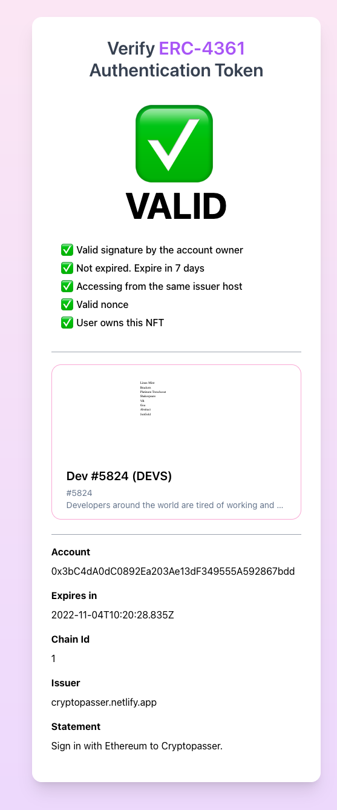
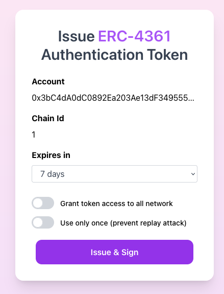
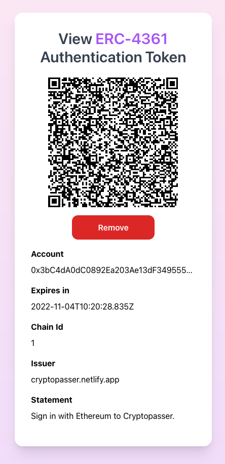
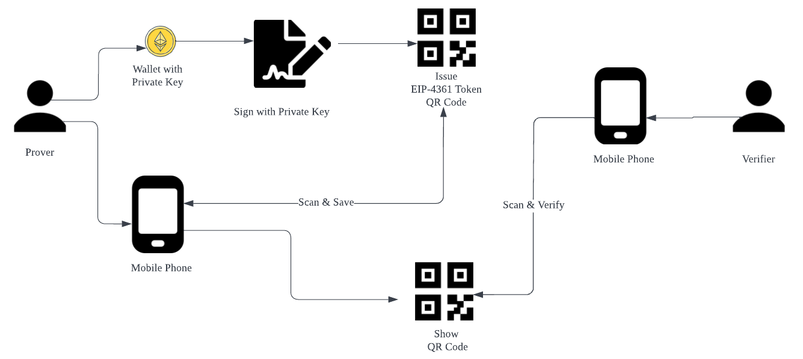

Cryptopasser is a mobile friendly web app to **issue, sign, store and verify** [EIP-4361 Sign-In with Ethereum](https://eips.ethereum.org/EIPS/eip-4361) authentication token. 

Cryptopasser works similar to JWT web token. However, for signing and verifying, it uses Ethereum's [EIP-191](https://eips.ethereum.org/EIPS/eip-191), and for data communication, it uses an offline QR code.

Two devices (signer and accesor) in an [air-gapped](https://en.wikipedia.org/wiki/Air_gap_%28networking%29) environment can share the access of a wallet from one account by creating a signed [EIP-4361](https://eips.ethereum.org/EIPS/eip-4361)  standard authentication certificate.

## Usage
This can be useful for the following usage. 

Imagine you need to prove an ownership of a NFT to gain access to a certain event. You have a hardware wallet that has a valuable NFT. However, you don't want to import your hardware wallet into your mobile device for security issues. 

With Cryptopasser, you just simply sign the token, save the signed token as a QR code image onto your phone. The event organizer scan the QR code, and verify that 1) you've signed the auth token and 2) you hold ownership of a NFT.  

## Demo

Fully working demo on [https://cryptopasser.netlify.app](https://cryptopasser.netlify.app)

## Security features

- Tokens expire after expiration date
- User can specify the specific chain id to make sure the token is only valid for a certain network.
- [CSRF protection](https://en.wikipedia.org/wiki/Cross-site_request_forgery). The auth token is only valid on the same domain as the issuing domain.
- It run offline. Internet is used only for fetching the NFT ownership  
- Prevent [replay attacks](https://en.wikipedia.org/wiki/Replay_attack). It can consider a token invalidated after the initial verification.

## Features to implement

- [ ] Add ERC20 token verfication mode
- [ ] Grant access to a certain NFT or token only not all NFT/token owned by the user
- [ ] Invalidate the token to prevent replay attacks (requires database to keep track of nonce)
- [ ] Implement own indexer API to check the NFT ownership instead of calling Opensea API 

## Run locally
`npm start`

## Pages
### `/issue` (Issue and Sign)

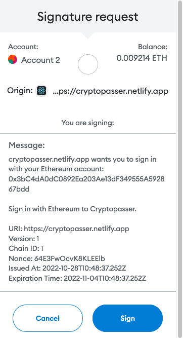
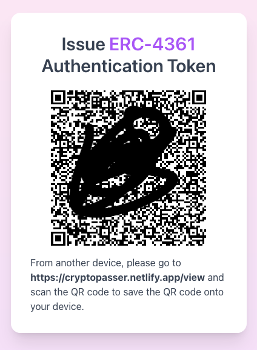

## `/view` (View and Save)
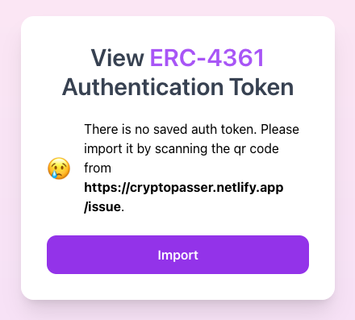
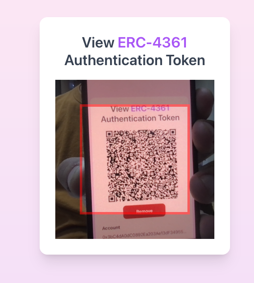

## `/verify` (Verify)
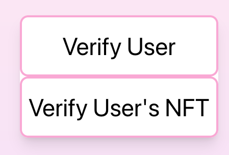
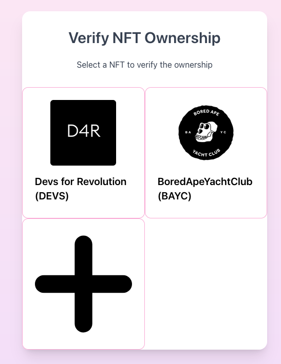

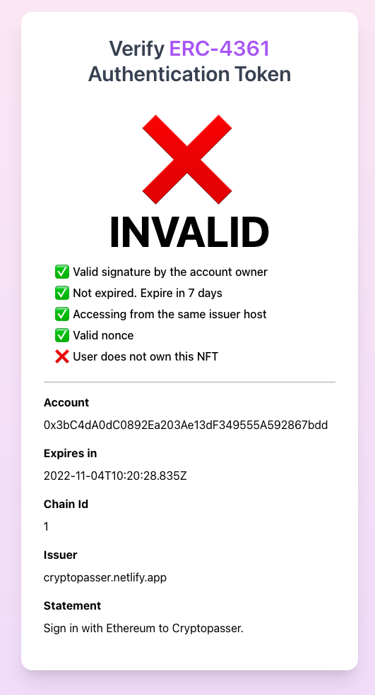

